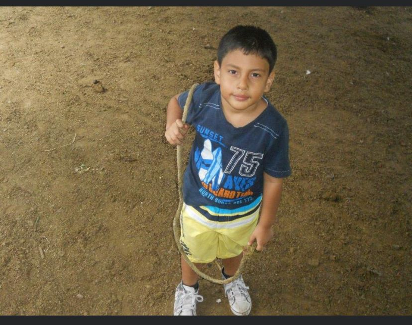
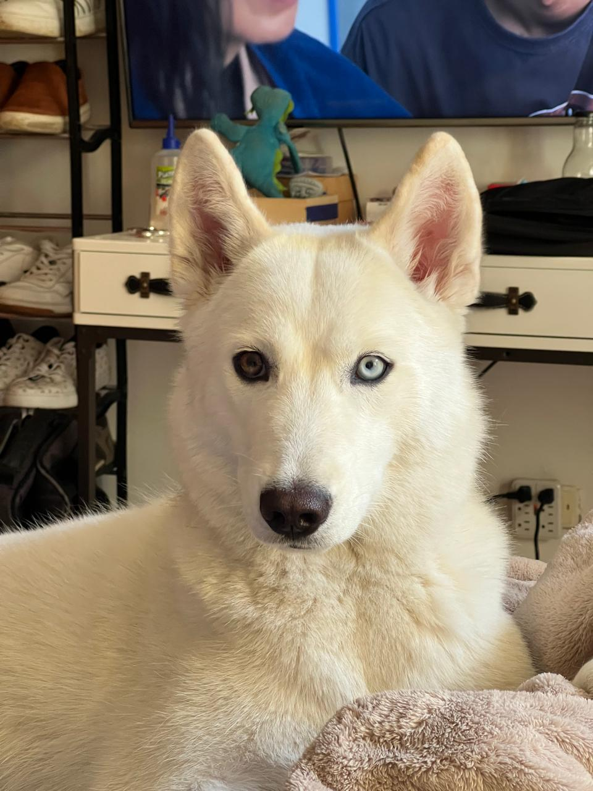
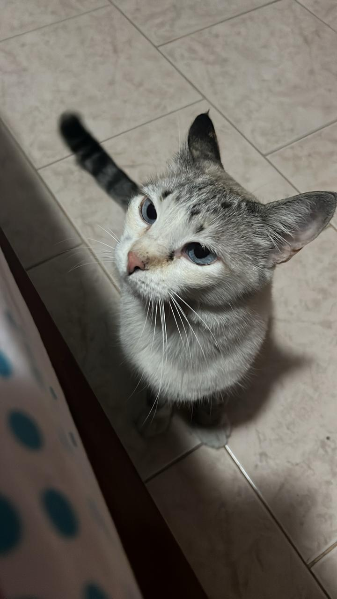

   # 🧑‍🎓Presentacion Personal

---
 + ## 🚀 Informacion Personal 
---
+ **Nombre**: Alejandro Serna Tovar
+ **Carrera**: Ingeniera de sistemas
+ **Edad**: 17 años
+ **Nacimiento**: 3 febrero 2008
+ **Ciudad**: Nacido y criado en Cali, Colombia
+ **Con quienes vivo**: Vivo con mis padres mi hermano mayor y mis mascotas

## 

+ ## 🐾 Mascotas 
---

## 
+ 🐶 **Perro**: Vainilla

## 
+ 🐱 **Gato**: Luna

+ ## ⏱️ Tiempo libre
---
 ### En mi tiempo libre suelo:
+ Ver series y peliculas
+ hacer deporte
+ jugar videojuegos
+ compartir tiempo con mi novia

+ ## 🎯 Metas a futuro
---
1. **Graduarme** en Ingenieria de sistemas
2. **Trabajar** aplicando todo lo aprendido en la carrera
3. **Ganar experiencia** en proyectos de desarrollo de software y ciberseguridad
4. **Formar una empresa** especializada en **ciberseguridad**

## 📌 Descripción del Proyecto y Pasos Realizados
1. Creacion del repositorio local con `git init`.
2. Creacion del archivo `Presentacion.md` con la informacion personal.
3. Gestión de cambios con `git add` y `git commit`.
4. Conexion del repositorio local con GitHub Classroom mediante `git remote add origin`.
5. Subida de cambios al repositorio remoto con `git push`.  
